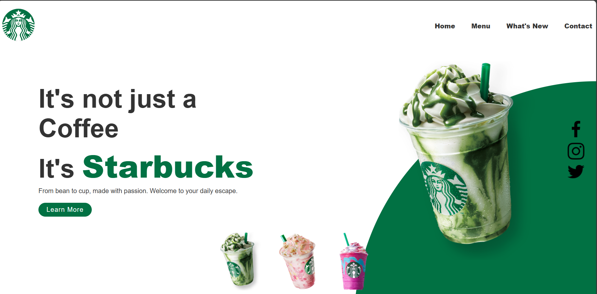

# Starbucks Landing Page 🌿

A responsive and interactive landing page for Starbucks, inspired by modern web design aesthetics. Built using HTML, CSS, and JavaScript.

## 🚀 Features

- Beautiful, clean layout with modern styling
- Interactive image slider for Starbucks drinks
- Animated background color changes based on selected drink
- Responsive design
- Social media icon section
- Custom navigation bar

## 📸 Preview



## 🛠️ Built With

- HTML5
- CSS3
- JavaScript (Vanilla)

## 🎯 Functionality

- Clicking on thumbnail images will:
  - Change the main product image (`imgSlider()` function)
  - Change the background circle color (`changeCircleColor()` function)
- Navigation bar is static and links are placeholders for demo purposes
- Responsive layout adjusts well on different screen sizes

## 📁 Folder Structure

```
├── index.html
├── style.css
├── script.js
└── images/
    ├── logo.png
    ├── img1.png
    ├── img2.png
    ├── img3.png
    ├── thumb1.png
    ├── thumb2.png
    ├── thumb3.png
    ├── facebook.png
    ├── instagram.png
    └── twitter.png
```

## 📌 How to Use

1. Clone this repository:
   ```bash
   git clone https://github.com/noahnoahnoahtran/3_starbucks.git
   ```
2. Open `index.html` in your browser.

## 📄 License

This project is for learning and demonstration purposes only.

---
